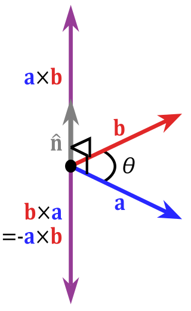

# Vector Products

Vector addition and subtraction are both very simple, but what of multiplication? It's not quite as easy. For a number of mathematical reasons that are beyond the scope of this book, multiplying component-wise isn't correct.

Instead, there are two different types of vector multiplication: **dot products**, and **cross products**.

## Dot products

The dot product (defined with a center circle, ⋅) is another simple operation: multiply the matching elements (X with X, Y with Y...), and then add all the products together. On paper, it looks like this:


The result might not immediately seem useful, but that changes with a certain property of the dot product's result:


Simply put, the result will always be the length of vector V, multiplied by the length of vector K, multiplied by the cosine of the angle between them.

This isn't especially useful on its own. However, if you use unit vectors, the results are much more useful. Since both lengths are equal to 1, you're left with just the cosine of the angle between them. If you put the result into an arccos function, you get the angle of the vectors between them.

In GLM, you can get the dot product as follows:

```c++
glm::dot(vec1, vec2);
```

## Cross product

The cross product (defined with the multiplication sign, ×) isn't nearly as commonly-used as the dot product, but it's still important to know. Unlike other vector operations, where any vector sizes are permitted so long as they are the same, cross products are only defined for vectors with three elements.

When used with two vectors that are orthogonal to each other, the resulting vector is orthogonal to both. This is best demonstrated via an image:



(Original image taken from Wikipedia and licensed under the public domain)


The cross-product formula is the first operation discussed that is not order-independent; B×A is not the same as A×B.

If you don't understand the cross product formula, don't worry, it isn't used very often. In addition, GLM provides a function for it:

```c++
glm::cross(vec1, vec2);
```
