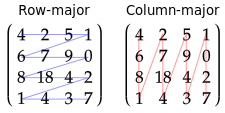

# Matrices

In mathematics, a matrix is a grid of elements. You can think of a matrix as being like a 2D array. For example:


Just like vectors, matrices can be of any size, but only sizes from 1 to 4 are used. Matrices are named based on their dimensions; a matrix that is 3 elements wide and 2 elements tall would be a 3x2 matrix. In computing, when the height and width are the same, it is common to abbreviate it to just the one number; a 4x4 matrix is just called a mat4 in GLM.

You can create a matrix in GLM as follows:

```c++
glm::mat4 matrix = glm::mat4(1.0f);
```

Matrices are very important for graphics programming; matrices are how you can move around your vertices without having to update their positions. Scaling, translation, and rotation are all accomplished using matrices.

## Row-major vs. column-major

There is some debate as to how matrices should be laid out in memory. Matrices are made up of rows (horizontal) and columns (vertical). There are two different ways a matrix can be laid out: row-major, and column-major.

In row-major, the index progresses from left to right, dropping down to the next row after reaching the end. In column-major matrices, the index progresses from top to bottom, moving right to the next column after reaching the end. To demonstrate:



In this example, if you looked at the fifth element, you'd see 6 if you were using row-major, or 2 if you're using column major.

GLM uses row-major for all operations, so this book will as well. **If you run into unexpected behavior while using matrices, it could be because you're using column-major instead.** Your first step for debugging should be to transpose the matrix. This will convert between row-major and column-major.

In GLM, transposing is very easy:

```c++
glm::transpose(matrix);
```
